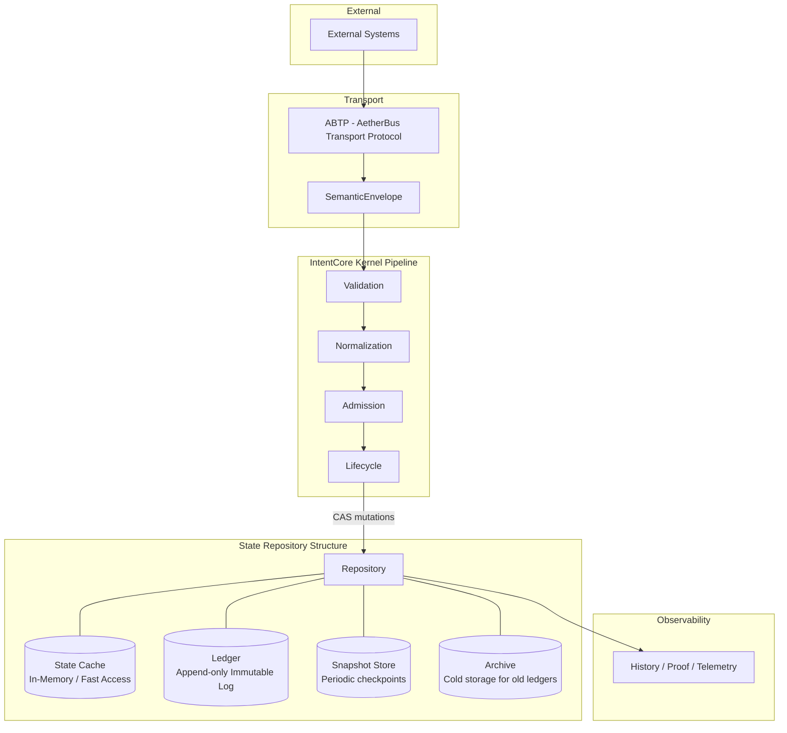

# IntentCore

A language-agnostic intent coordination kernel that provides deterministic lifecycle management, state consistency, policy enforcement, and proof-oriented coordination for distributed autonomous systems.

IntentCore uses ABTP (AetherBus Transport Protocol) as its transport boundary while keeping validation, normalization, admission, lifecycle control, state mutation, history, proof, and telemetry inside the kernel.

## Architectural Identity

The project is intentionally split into four stable names:

| Name | Architectural role |
| --- | --- |
| IntentCore | Kernel and center of system coordination |
| ABTP | Transport boundary and protocol layer |
| SemanticEnvelope | Wire format carried by ABTP |
| RFC | Locked contract for stable implementation behavior |

This naming model prevents the early-project ambiguity where AetherBus could mean the project, the broker, the transport, or the protocol. IntentCore is now the coordination kernel; ABTP is the transport protocol that carries SemanticEnvelope into it.

## Architecture Blueprint

The repository blueprint is maintained in [IntentCore Architecture Landscape](docs/architecture-landscape.md). It documents the architecture boundaries, frozen core contracts, implementation phases, internal data flow, architectural principles, historical naming context, and next-phase development direction.

## System Architecture Diagram

The system operates strictly with a one-way dependency flow, ensuring that external interactions undergo validation, normalization, and admission before the `Lifecycle` acts on them. All states are mutated via CAS within the single-source-of-truth `Repository`, which is structured specifically to support event sourcing with immutable logs.

