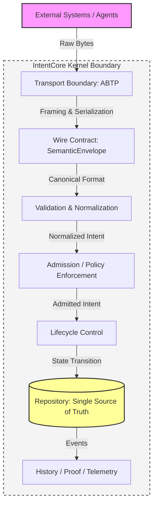
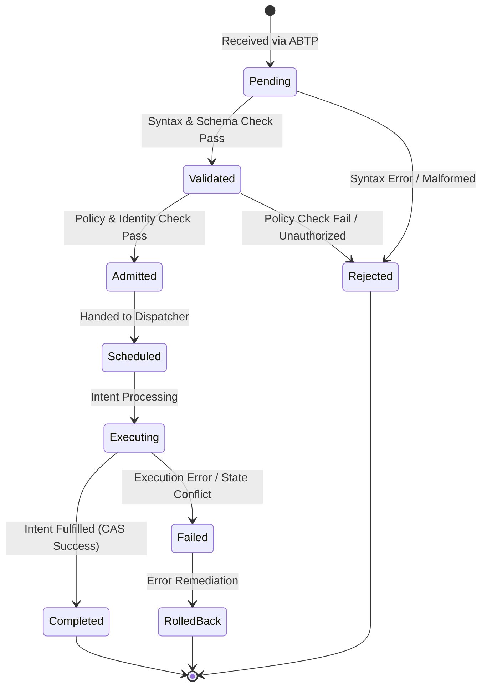

# IntentCore Architecture Landscape & Specification

**Version:** 1.0.0
**Status:** Active / Normative
**Category:** Architectural Blueprint
**One-line Definition:** IntentCore is a transport-agnostic intent coordination kernel enforcing deterministic lifecycle management, state consistency, and proof-oriented governance for distributed autonomous systems.

---

## 1. Executive Summary

This document specifies the normative architecture of the IntentCore system. IntentCore (IC) SHALL operate exclusively as an intent coordination kernel. Its explicit mandate is to govern validated intent admission, enforce deterministic lifecycle control, execute authoritative state mutations, and maintain immutable records of system history, cryptographic proofs, and telemetry.

The system MUST remain strictly decoupled from transport-layer mechanics. The AetherBus Transport Protocol (ABTP) MUST serve strictly as a stateless transport boundary, whose sole responsibility is the ingestion and delivery of the canonical `SemanticEnvelope` into the kernel runtime.

## 2. Architectural Constitution (Invariants)

This section serves as the supreme normative constitution of the system. All components, modules, and future extensions MUST comply with the following invariants, utilizing terminology defined in IETF RFC 2119.

1. **State Mutation:** Every authoritative state mutation MUST originate exclusively from a fully validated and admitted Intent.
2. **Transport Statelessness:** Transport mechanisms MUST be stateless. The transport boundary MUST NOT execute lifecycle decisions, policy evaluations, or state mutations.
3. **Transport Agnosticism:** The IC kernel MUST be strictly transport-agnostic. All external data ingestion MUST cross the boundary via the ABTP interface.
4. **Single Source of Truth:** The Repository MUST remain the singular authoritative source of truth. Mutations MUST utilize a Compare-And-Swap (CAS) mechanism to guarantee concurrency safety.
5. **Immutable History:** The system history MUST be an append-only ledger. Data MUST NOT be overwritten, deleted, or altered.
6. **Strict One-Way Dependency:** Execution pipelines MUST flow unidirectionally. Outer layers MUST NOT bypass intermediate stages or directly modify inner state.

## 3. System Boundaries & Terminology

To prevent structural drift and ambiguity, the architecture locks the following terminology and boundaries:

* **IntentCore (Coordination Kernel):** The central computational engine responsible exclusively for intent lifecycle, policy enforcement, and state governance.
* **ABTP (Transport Boundary):** The protocol layer responsible only for framing, checksum validation, serialization, and network I/O.
* **SemanticEnvelope (Wire Contract):** The canonical data structure and mandatory format for all external communication entering the IC kernel.
* **RFC (Frozen Contract):** Normative, immutable rules that all implementations MUST conform to.
* **ADR (Internal Rule):** Architecture Decision Records documenting the engineering rationale behind internal implementations.

## 4. Execution Flow

The system MUST enforce a strict, unidirectional execution pipeline to guarantee architectural integrity.

**Pipeline Flow:**
`External Systems ──> ABTP ──> SemanticEnvelope ──> Validation/Normalization ──> Admission ──> Lifecycle ──> Repository (State/History/Proof/Telemetry)`

### 4.1 Strict One-Way Dependency Diagram



### 4.2 Deterministic Lifecycle State Machine

(Note: `StateUnknown` acts exclusively as an uninitialized sentinel value, with `Pending` representing the initial operational state).



## 5. Contract Mapping

The architecture relies on Dependency Inversion. Implementations MUST adhere to the following interface contracts.

**contracts/intent.go** (Core Semantic Primitive)
```go
package contracts

// Intent expresses a desired outcome rather than an execution procedure.
// Implementations MUST ensure that an Intent remains immutable once created.
type Intent interface {
	ID() string
	Type() string
	Issuer() string
	Payload() []byte
}

// AdmittedIntent represents an Intent that has successfully passed Admission.
// Only AdmittedIntents SHALL be processed by the Lifecycle.
type AdmittedIntent interface {
	Intent
	AdmittedAt() int64
	PolicyVersion() string
}
```

**contracts/envelope.go** (Canonical Wire Contract)
```go
package contracts

// SemanticEnvelope is the canonical wire contract.
// Every external system MUST communicate with the kernel utilizing this structure.
type SemanticEnvelope struct {
	Version   string
	Signature []byte
	Intent    Intent
}
```

**contracts/admission.go** (Screening Boundary)
```go
package contracts

import "context"

// AdmissionController serves as the strict gateway into the Lifecycle phase.
// Implementations MUST NOT mutate authoritative system state.
type AdmissionController interface {
	Validate(ctx context.Context, env *SemanticEnvelope) error
	Evaluate(ctx context.Context, env *SemanticEnvelope) (AdmittedIntent, error)
}
```

**contracts/lifecycle.go** (Lifecycle Management)
```go
package contracts

import "context"

// LifecycleMachine is the sole authority permitted to perform state transitions.
type LifecycleMachine interface {
	Transition(ctx context.Context, intent AdmittedIntent) (State, error)
	CurrentState(intentID string) (State, error)
}
```

**contracts/repository.go** (Append-only & CAS Persistence)
```go
package contracts

import "context"

// Repository acts as the Single Source of Truth.
// Outer layers MUST interact with the repository exclusively through these methods.
type Repository interface {
	Load(ctx context.Context, key string) ([]byte, uint64, error)
	CompareAndSwap(ctx context.Context, key string, oldValue, newValue []byte, version uint64) (uint64, error)
	AppendHistory(ctx context.Context, intentID string, transitionData []byte) error
}
```

## 6. Non-Goals

To maintain focus and system integrity, the following operations are strictly out of scope:
* **NOT a Message Broker:** The system SHALL NOT act as a generic pub/sub router or arbitrary message fan-out engine.
* **NOT a Workflow Engine:** The system SHALL NOT coordinate long-running distributed sagas with arbitrary external side-effects outside of its defined intent lifecycle.
* **NOT a Transport Protocol:** The IC kernel SHALL NOT natively handle low-level network packets, sockets, or TCP/UDP handshakes.
